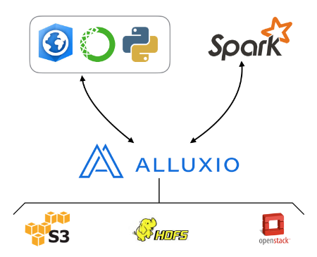
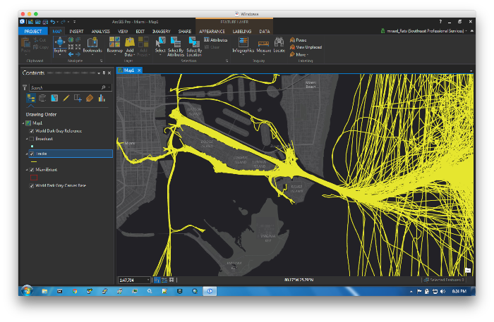
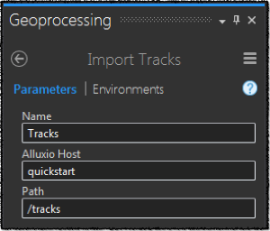
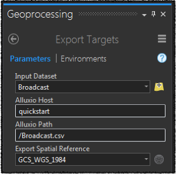
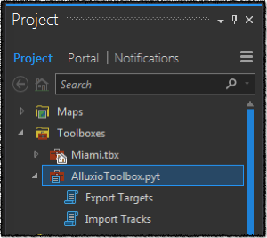

# ArcGIS Alluxio Integration - Spark Track Assembler

This Proof of Concept project demonstrates the integration of [ArcGIS](https://pro.arcgis.com/en/pro-app/) with [Alluxio](http://www.alluxio.org/) and is composed of 2 sub projects:

- A [Spark](http://spark.apache.org/) based application that:
    - Reads [AIS](https://en.wikipedia.org/wiki/Automatic_identification_system) target data from Alluxio.
    - Assembles the AIS targets into tracks.
    - Smooths the tracks using a [lowpass filter](http://phrogz.net/js/framerate-independent-low-pass-filter.html).
    - Saves the tracks in WKT format into Alluxio.

- An [ArcPy](http://pro.arcgis.com/en/pro-app/arcpy/get-started/what-is-arcpy-.htm) based toolbox that:
    - Exports a feature class content into a file in WKT format in Alluxio, in such that it will be used by the above mentioned Spark App.
    - Imports the assembled tracks and create an ephemeral feature class to be viewed on a map.





## AIS Data

AIS data can be found at [MarineCadastre.gov](https://marinecadastre.gov/ais/).  For this PoC, download the [Miami Port Sample Data](ftp://ftp.coast.noaa.gov/temp/MarineCadastre/AIS.SampleData.zip).  It is a zip file that contains a [File GeoDatabase](http://desktop.arcgis.com/en/arcmap/10.3/manage-data/administer-file-gdbs/file-geodatabases.htm) with a point feature class that contains AIS broadcast features.

## Start Alluxio

Check out [this link](http://www.alluxio.org/docs/1.4/en/Getting-Started.html) for a quickstart. In addition, check out [what is new in Alluxio 1.4.0](https://alluxio.com/blog/whats-new-in-alluxio-140), and focus on the 'Native File System REST Interface' section, as we will use this interface in the ArcPy tools to write and read information to and from Alluxio. This is the integration point.

Start a local Alluxio master, worker and proxy using:

```
${ALLUXIO_HOME}/bin/alluxio-start.sh all -f
```

BTW, the `-f` at the end of the command formats the _Alluxio_ underlying file system, and that is _totally_ different than your file system.

## REST Interaction

The following is a sample session that uses the Alluxio REST interface:

Get information about the master and the worker:

```
curl -XGET localhost:19999/api/v1/master/info
curl -XGET localhost:30000/api/v1/worker/info
```

List the files in the `/tracks` Alluxio folder:

```
curl -XGET localhost:19999/api/v1/master/file/list_status?path=/tracks
```

Get a stream ID for the file `/tracks/part-00006-a43cf760-b8d2-4a4b-96f7-cd640473f8a7.csv`:

```
curl -XPOST localhost:39999/api/v1/paths//tracks/part-00006-a43cf760-b8d2-4a4b-96f7-cd640473f8a7.csv/open-file
```

Assuming the returned stream ID is `18`, read the content of the file and close the stream:

```
curl -XPOST localhost:39999/api/v1/streams/18/read
curl -XPOST localhost:39999/api/v1/streams/18/close
```

## ArcGIS Alluxio Integration

Add the `AlluxioToolbox` to [ArcGIS Pro](https://pro.arcgis.com/en/pro-app). The tools depend heavily on the [requests](http://docs.python-requests.org/en/master/) python module to interact with the Alluxio REST endpoint.



The `Export Targets` tool exports the features from a selected feature class into a file in Alluxio in TSV format where the geometry is in [WKT](https://en.wikipedia.org/wiki/Well-known_text) format.



The `Import Track` tool imports the content of files in Alluxio as features into an ephemeral feature class to be displayed on the map.



## Track Assembly

`TrackAssembler` is a Scala Spark application that reads the exported targets from an Alluxio based file, assembles them into a set of tracks and saves the tracks into Alluxio.  The target assembly is based on time and distance, where a track is composed of a set of consecutive targets that are within a user defined space and time offset from each other.  The result in Alluxio is in TSV format where the geometry is in WKT format.

### Building The Application

The build process is based on [Apache Maven](https://maven.apache.org/).

```
mvn clean package
```

### Running The Application

```
spark-submit\
 --master local[*]\
 --driver-memory 16G\
 --executor-memory 16G\
 --jars ${ALLUXIO_HOME}/core/client/target/alluxio-core-client-1.4.0-jar-with-dependencies.jar\
 --conf spark.ui.enabled=false\
 --conf spark.app.time.millis=3600000\
 --conf spark.app.dist.meters=3000\
 --conf spark.app.alpha=0.85\
 --conf spark.app.input.path=alluxio://localhost:19998/Broadcast.csv\
 --conf spark.app.output.repartition=8\
 --conf spark.app.output.path=alluxio://localhost:19998/tracks\
 target/arcgis-alluxio-0.1-jar-with-dependencies.jar
```

The configuration `spark.app.time.millis` defines in milliseconds the time tolerance for a target to belong to a track.
The configuration `spark.app.dist.meters` defines in meter the distance tolerance for a target to belong to a track.
Both conditions have to be met for track assembly.

### Path Finder App

```
time spark-submit\
 --master local[*]\
 --class com.esri.PathFinder\
 --driver-memory 16G\
 --executor-memory 16G\
 --jars ${ALLUXIO_HOME}/core/client/target/alluxio-core-client-1.4.0-jar-with-dependencies.jar\
 --conf spark.ui.enabled=false\
 target/arcgis-alluxio-0.1-jar-with-dependencies.jar
```

`PathFinder` is an application that assembles tracks from targets based on a unique target attribute value and the proximity of targets to each other by space and time.  A mesh with square cells is overlaid on each track and the track is decomposed into the cells that intersect the track. The result is saved in [parquet](https://parquet.apache.org/) format in Alluxio.

### Bonus App (HexApp)

```
time spark-submit\
 --master local[*]\
 --class com.esri.HexApp\
 --driver-memory 16G\
 --executor-memory 16G\
 --jars ${ALLUXIO_HOME}/core/client/target/alluxio-core-client-1.4.0-jar-with-dependencies.jar\
 --conf spark.ui.enabled=false\
 target/arcgis-alluxio-0.1-jar-with-dependencies.jar
```

### References

- https://movement.uber.com/cities
- http://wesmckinney.com/blog/python-parquet-update/
- http://phrogz.net/js/framerate-independent-low-pass-filter.html

### Alluxio On Docker (Reference Only)

```
docker run -it\
 --rm\
 --name localhost\
 -p 19998:19998\
 -p 19999:19999\
 alluxio master
```

```
export SHM_SIZE=2GB
docker run -it --rm\
 --shm-size=$SHM_SIZE\
 --hostname localhost\
 --name localhost\
 --link localhost:localhost\
 -p 29998:29998\
 -p 29999:29999\
 -p 30000:30000\
 -e ALLUXIO_MASTER_HOSTNAME=localhost\
 -e ALLUXIO_MASTER_PORT=19998\
 -e ALLUXIO_WORKER_MEMORY_SIZE=$SHM_SIZE\
 alluxio worker
```

```
docker run -it --rm\
 --hostname localhost\
 --name localhost\
 --link localhost:localhost\
 -p 39999:39999\
 -e ALLUXIO_MASTER_HOSTNAME=localhost\
 -e ALLUXIO_MASTER_PORT=19998\
 alluxio proxy
```
